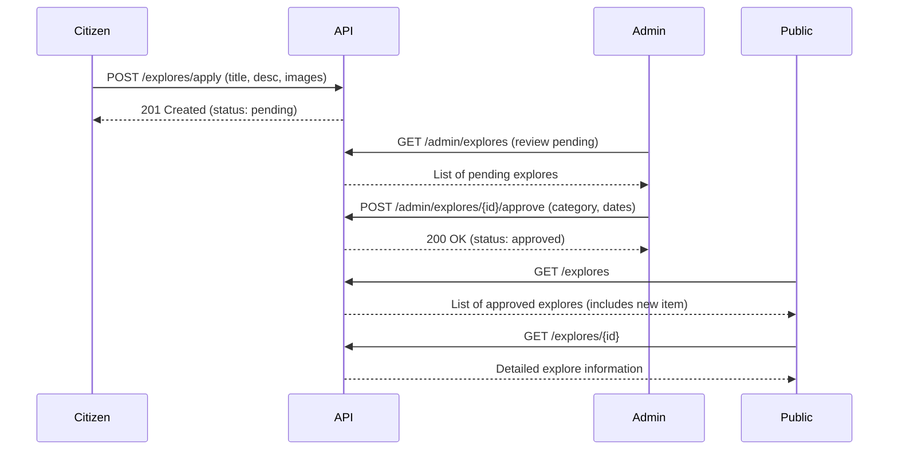

# Explores API Documentation

## Overview
The Explores feature allows citizens to create and share promotions or posts about local businesses, events, and community activities. It supports two types of content: **promotions** (business advertisements with time limits) and **posts** (general community content). All explore submissions require admin approval before being publicly visible.

## Database Schema

### Table: `explores`
| Field | Type | Description |
|-------|------|-------------|
| `id` | ULID | Primary key (unique identifier) |
| `title` | string | Title of the explore item |
| `desc` | text | Detailed description |
| `category` | string | Category of the explore (e.g., "Restaurant", "Event", "Service") |
| `type` | enum | Type: `promotion` or `post` |
| `citizen_id` | ULID | Foreign key to users table (creator) |
| `images_url` | json | Array of image URLs |
| `start_date` | date | Start date (for promotions/events) |
| `end_date` | date | End date (for promotions/events) |
| `status` | enum | Status: `pending` or `approved` (default: `pending`) |
| `created_at` | timestamp | Creation timestamp |
| `updated_at` | timestamp | Last update timestamp |

## API Endpoints

### Base URL
```
/api
```

### Authentication
- All endpoints except public listing require authentication via Sanctum token
- Admin endpoints require `admin` or `superadmin` role

---

## Public Endpoints (No Authentication Required)

### 1. List All Explores (Public)
**GET** `/explores`

Returns a paginated list of all explores with citizen information.

#### Query Parameters
None (automatically paginates)

#### Response
```json
{
  "status": "success",
  "message": "Explores retrieved successfully",
  "data": [
    {
      "id": "01HN5X...",
      "title": "Summer Sale at Local Cafe",
      "desc": "Enjoy 20% off all beverages this summer!",
      "category": "Restaurant",
      "type": "promotion",
      "citizen_id": "01HN5X...",
      "citizen": {
        "id": "01HN5X...",
        "full_name": "John Doe",
        "phonenumber": "+1234567890"
      },
      "images_url": [
        "https://storage.com/explore/images/abc123.jpg"
      ],
      "start_date": "2026-06-01",
      "end_date": "2026-08-31",
      "status": "approved",
      "created_at": "2026-01-06T10:30:00.000000Z",
      "updated_at": "2026-01-06T11:00:00.000000Z"
    }
  ],
  "meta": {
    "current_page": 1,
    "last_page": 5,
    "per_page": 10,
    "total": 45
  }
}
```

---

### 2. Get Explores Grouped by Users
**GET** `/explores/grouped-by-users`

Returns a list of users who have approved explores. Useful for displaying business/citizen profiles.

#### Response
```json
{
  "status": "success",
  "message": "Users with explores retrieved successfully",
  "data": [
    {
      "id": "01HN5X...",
      "name": "John's Cafe"
    },
    {
      "id": "01HN5Y...",
      "name": "Local Hardware Store"
    }
  ]
}
```

---

### 3. Get Explores by User ID
**GET** `/explores/by-user/{userId}`

Returns all approved explores created by a specific user.

#### Path Parameters
| Parameter | Type | Description |
|-----------|------|-------------|
| `userId` | ULID | User ID to filter explores |

#### Response
```json
{
  "status": "success",
  "message": "User explores retrieved successfully",
  "data": [
    {
      "id": "01HN5X...",
      "title": "New Product Launch",
      "desc": "Check out our latest product!",
      "category": "Retail",
      "type": "promotion",
      "citizen_id": "01HN5X...",
      "citizen": {
        "id": "01HN5X...",
        "full_name": "Jane Smith",
        "phonenumber": "+1234567890"
      },
      "images_url": ["https://..."],
      "start_date": "2026-01-10",
      "end_date": "2026-02-10",
      "status": "approved",
      "created_at": "2026-01-06T10:30:00.000000Z",
      "updated_at": "2026-01-06T11:00:00.000000Z"
    }
  ]
}
```

---

### 4. Get Single Explore
**GET** `/explores/{explore}`

Returns detailed information about a specific explore item.

#### Path Parameters
| Parameter | Type | Description |
|-----------|------|-------------|
| `explore` | ULID | Explore ID |

#### Response
```json
{
  "status": "success",
  "message": "Explore retrieved successfully",
  "data": {
    "id": "01HN5X...",
    "title": "Community Art Festival",
    "desc": "Join us for a day of art, music, and culture!",
    "category": "Event",
    "type": "post",
    "citizen_id": "01HN5X...",
    "citizen": {
      "id": "01HN5X...",
      "full_name": "Cultural Center",
      "phonenumber": "+1234567890"
    },
    "images_url": [
      "https://storage.com/explore/images/event1.jpg",
      "https://storage.com/explore/images/event2.jpg"
    ],
    "start_date": "2026-03-15",
    "end_date": "2026-03-15",
    "status": "approved",
    "created_at": "2026-01-06T10:30:00.000000Z",
    "updated_at": "2026-01-06T11:00:00.000000Z"
  }
}
```

---

## Authenticated User Endpoints

### 5. Apply for Explore (Citizen)
**POST** `/explores/apply`

Allows authenticated citizens to submit a new explore application. The application will have `pending` status and require admin approval.

#### Headers
```
Authorization: Bearer {token}
Content-Type: multipart/form-data
```

#### Request Body (multipart/form-data)
| Field | Type | Required | Description |
|-------|------|----------|-------------|
| `title` | string | Yes | Title (max 255 characters) |
| `desc` | string | Yes | Detailed description |
| `type` | enum | Yes | Either `promotion` or `post` |
| `images` | file[] | No | Array of images (jpg, jpeg, png, svg, max 5MB each) |

**Note:** 
- `citizen_id`, `status`, `category`, `start_date`, and `end_date` are **not** required for apply endpoint
- The `citizen_id` is automatically set to the authenticated user
- Status is automatically set to `pending`

#### Example Request
```bash
curl -X POST https://api.municipality.com/api/explores/apply \
  -H "Authorization: Bearer YOUR_TOKEN" \
  -H "Content-Type: multipart/form-data" \
  -F "title=New Restaurant Opening" \
  -F "desc=Come visit our new location downtown!" \
  -F "type=promotion" \
  -F "images[]=@/path/to/image1.jpg" \
  -F "images[]=@/path/to/image2.jpg"
```

#### Response (201 Created)
```json
{
  "status": "success",
  "message": "Explore application submitted successfully",
  "data": {
    "id": "01HN5X...",
    "title": "New Restaurant Opening",
    "desc": "Come visit our new location downtown!",
    "category": null,
    "type": "promotion",
    "citizen_id": "01HN5X...",
    "citizen": {
      "id": "01HN5X...",
      "full_name": "Restaurant Owner",
      "phonenumber": "+1234567890"
    },
    "images_url": [
      "https://storage.com/explore/images/abc123.jpg",
      "https://storage.com/explore/images/def456.jpg"
    ],
    "start_date": null,
    "end_date": null,
    "status": "pending",
    "created_at": "2026-01-06T10:30:00.000000Z",
    "updated_at": "2026-01-06T10:30:00.000000Z"
  }
}
```

---

## Admin Endpoints

### 6. Create Explore (Admin)
**POST** `/admin/explores`

Admin can directly create an explore with full control over all fields.

#### Headers
```
Authorization: Bearer {admin_token}
Content-Type: multipart/form-data
```

#### Request Body (multipart/form-data)
| Field | Type | Required | Description |
|-------|------|----------|-------------|
| `title` | string | Yes | Title (max 255 characters) |
| `desc` | string | Yes | Detailed description |
| `category` | string | Yes | Category (max 255 characters) |
| `type` | enum | Yes | Either `promotion` or `post` |
| `citizen_id` | ULID | Yes | User ID of the citizen |
| `images` | file[] | No | Array of images (jpg, jpeg, png, svg, max 5MB each) |
| `start_date` | date | Yes | Start date (YYYY-MM-DD) |
| `end_date` | date | Yes | End date (must be >= start_date) |
| `status` | enum | No | Either `pending` or `approved` |

#### Example Request
```bash
curl -X POST https://api.municipality.com/api/admin/explores \
  -H "Authorization: Bearer ADMIN_TOKEN" \
  -H "Content-Type: multipart/form-data" \
  -F "title=Holiday Market" \
  -F "desc=Annual holiday market with local vendors" \
  -F "category=Event" \
  -F "type=post" \
  -F "citizen_id=01HN5X..." \
  -F "start_date=2026-12-15" \
  -F "end_date=2026-12-25" \
  -F "status=approved" \
  -F "images[]=@/path/to/image1.jpg"
```

#### Response (201 Created)
```json
{
  "status": "success",
  "message": "Explore created successfully",
  "data": {
    "id": "01HN5X...",
    "title": "Holiday Market",
    "desc": "Annual holiday market with local vendors",
    "category": "Event",
    "type": "post",
    "citizen_id": "01HN5X...",
    "citizen": {
      "id": "01HN5X...",
      "full_name": "Community Center",
      "phonenumber": "+1234567890"
    },
    "images_url": ["https://storage.com/explore/images/xyz789.jpg"],
    "start_date": "2026-12-15",
    "end_date": "2026-12-25",
    "status": "approved",
    "created_at": "2026-01-06T10:30:00.000000Z",
    "updated_at": "2026-01-06T10:30:00.000000Z"
  }
}
```

---

### 7. Update Explore (Admin)
**PUT/PATCH** `/admin/explores/{explore}`

Admin can update any field of an explore.

#### Headers
```
Authorization: Bearer {admin_token}
Content-Type: multipart/form-data
```

#### Request Body (multipart/form-data)
All fields are optional (use `sometimes` validation):

| Field | Type | Description |
|-------|------|-------------|
| `title` | string | Title (max 255 characters) |
| `desc` | string | Detailed description |
| `category` | string | Category (max 255 characters) |
| `type` | enum | Either `promotion` or `post` |
| `citizen_id` | ULID | User ID of the citizen |
| `images` | file[] | Array of images (replaces old images) |
| `start_date` | date | Start date (YYYY-MM-DD) |
| `end_date` | date | End date (must be >= start_date) |
| `status` | enum | Either `pending` or `approved` |

**Note:** If new images are uploaded, old images are automatically deleted.

#### Example Request
```bash
curl -X PUT https://api.municipality.com/api/admin/explores/01HN5X... \
  -H "Authorization: Bearer ADMIN_TOKEN" \
  -H "Content-Type: multipart/form-data" \
  -F "title=Updated Title" \
  -F "status=approved"
```

#### Response
```json
{
  "status": "success",
  "message": "Explore updated successfully",
  "data": {
    "id": "01HN5X...",
    "title": "Updated Title",
    "desc": "Original description",
    "category": "Event",
    "type": "post",
    "citizen_id": "01HN5X...",
    "citizen": {
      "id": "01HN5X...",
      "full_name": "Community Center",
      "phonenumber": "+1234567890"
    },
    "images_url": ["https://storage.com/explore/images/xyz789.jpg"],
    "start_date": "2026-12-15",
    "end_date": "2026-12-25",
    "status": "approved",
    "created_at": "2026-01-06T10:30:00.000000Z",
    "updated_at": "2026-01-06T14:20:00.000000Z"
  }
}
```

---

### 8. Approve Explore (Admin)
**POST** `/admin/explores/{explore}/approve`

Dedicated endpoint for approving a pending explore application.

#### Headers
```
Authorization: Bearer {admin_token}
Content-Type: application/json
```

#### Request Body (JSON)
| Field | Type | Required | Description |
|-------|------|----------|-------------|
| `category` | string | No | Can set/update category during approval |
| `start_date` | date | No | Can set start date during approval |
| `end_date` | date | No | Can set end date during approval |

#### Example Request
```bash
curl -X POST https://api.municipality.com/api/admin/explores/01HN5X.../approve \
  -H "Authorization: Bearer ADMIN_TOKEN" \
  -H "Content-Type: application/json" \
  -d '{
    "category": "Restaurant",
    "start_date": "2026-01-10",
    "end_date": "2026-03-10"
  }'
```

#### Response
```json
{
  "status": "success",
  "message": "Explore approved successfully",
  "data": {
    "id": "01HN5X...",
    "title": "New Restaurant Opening",
    "desc": "Come visit our new location downtown!",
    "category": "Restaurant",
    "type": "promotion",
    "citizen_id": "01HN5X...",
    "citizen": {
      "id": "01HN5X...",
      "full_name": "Restaurant Owner",
      "phonenumber": "+1234567890"
    },
    "images_url": ["https://storage.com/explore/images/abc123.jpg"],
    "start_date": "2026-01-10",
    "end_date": "2026-03-10",
    "status": "approved",
    "created_at": "2026-01-06T10:30:00.000000Z",
    "updated_at": "2026-01-06T15:00:00.000000Z"
  }
}
```

---

### 9. Delete Explore (Admin)
**DELETE** `/admin/explores/{explore}`

Admin can delete an explore. Associated images are automatically deleted from storage.

#### Headers
```
Authorization: Bearer {admin_token}
```

#### Response
```json
{
  "status": "success",
  "message": "Explore deleted successfully",
  "data": null
}
```

---

## Data Models

### Explore Model
```php
class Explore extends Model
{
    protected $fillable = [
        'title',
        'desc',
        'category',
        'type',
        'citizen_id',
        'images_url',
        'start_date',
        'end_date',
        'status',
    ];

    protected $casts = [
        'images_url' => 'array',
        'start_date' => 'date',
        'end_date' => 'date',
    ];

    // Relationship
    public function citizen(): BelongsTo
    {
        return $this->belongsTo(User::class, 'citizen_id');
    }
}
```

---

## Validation Rules

### StoreExploreRequest (Admin Create)
```php
[
    'title' => 'required|string|max:255',
    'desc' => 'required|string',
    'category' => 'required|string|max:255',
    'type' => 'required|in:promotion,post',
    'citizen_id' => 'required|exists:users,id',
    'images' => 'nullable|array',
    'images.*' => 'file|mimes:jpg,jpeg,png,svg|max:5120', // Max 5MB per image
    'start_date' => 'required|date',
    'end_date' => 'required|date|after_or_equal:start_date',
    'status' => 'sometimes|in:pending,approved',
]
```

### ApplyExploreRequest (Citizen Apply)
```php
[
    'title' => 'required|string|max:255',
    'desc' => 'required|string',
    'type' => 'required|in:promotion,post',
    'images' => 'nullable|array',
    'images.*' => 'file|mimes:jpg,jpeg,png,svg|max:5120', // Max 5MB per image
]
// Note: category, start_date, end_date, citizen_id, and status are not required
```

### UpdateExploreRequest (Admin Update)
```php
[
    'title' => 'sometimes|string|max:255',
    'desc' => 'sometimes|string',
    'category' => 'sometimes|string|max:255',
    'type' => 'sometimes|in:promotion,post',
    'citizen_id' => 'sometimes|exists:users,id',
    'images' => 'nullable|array',
    'images.*' => 'file|mimes:jpg,jpeg,png,svg|max:5120',
    'start_date' => 'sometimes|date',
    'end_date' => 'sometimes|date|after_or_equal:start_date',
    'status' => 'sometimes|in:pending,approved',
]
```

### ApproveExploreRequest (Admin Approve)
```php
[
    'category' => 'sometimes|string|max:255',
    'start_date' => 'sometimes|date',
    'end_date' => 'sometimes|date|after_or_equal:start_date',
]
// Status is automatically set to 'approved'
```

---

## Error Responses

### Validation Error (422)
```json
{
  "message": "The given data was invalid.",
  "errors": {
    "title": ["The title field is required."],
    "type": ["The selected type is invalid."]
  }
}
```

### Unauthorized (401)
```json
{
  "message": "Unauthenticated."
}
```

### Forbidden (403)
```json
{
  "status": "error",
  "message": "Unauthorized"
}
```

### Not Found (404)
```json
{
  "message": "No query results for model [App\\Models\\Explore] ..."
}
```

---

## File Upload Details

### Image Storage
- **Path:** `storage/app/public/explore/images/`
- **Accepted Formats:** JPG, JPEG, PNG, SVG
- **Max Size:** 5MB per image
- **Multiple Uploads:** Yes, array of images
- **Auto-deletion:** Old images are deleted when updating with new images

### File Naming
Files are automatically renamed with unique identifiers to prevent conflicts.

---

## Use Cases

### 1. Local Business Promotion
A restaurant owner wants to promote a summer sale:
1. Citizen logs in and calls **POST /explores/apply**
2. Submits promotion with title, description, images
3. Status is set to `pending`
4. Admin reviews and calls **POST /admin/explores/{id}/approve**
5. Admin sets category="Restaurant", start/end dates
6. Promotion becomes visible to all users in **GET /explores**

### 2. Community Event Post
A community center wants to announce an art festival:
1. Admin directly creates via **POST /admin/explores**
2. Sets type="post", category="Event", dates
3. Status set to "approved" immediately
4. Event appears in public listing

### 3. User Browsing by Business
Users want to see all promotions from a specific business:
1. Call **GET /explores/grouped-by-users** to get list of businesses
2. Select a business by ID
3. Call **GET /explores/by-user/{userId}** to see all their approved explores

---

## Best Practices

1. **Image Optimization:** Compress images before upload to reduce file size
2. **Date Validation:** Ensure end_date is after start_date for promotions
3. **Status Management:** Always check status="approved" for public display
4. **Category Consistency:** Use consistent category names for better filtering
5. **Pagination:** Handle pagination for large datasets in listing endpoints
6. **Error Handling:** Implement proper error handling for file upload failures
7. **Security:** Validate file types on both client and server side

---

## Sample Workflow



---

## Testing Endpoints with cURL

### Apply for Explore (Citizen)
```bash
curl -X POST http://localhost:8000/api/explores/apply \
  -H "Authorization: Bearer YOUR_TOKEN" \
  -F "title=My Business" \
  -F "desc=Great products and services" \
  -F "type=promotion" \
  -F "images[]=@./image1.jpg"
```

### Approve Explore (Admin)
```bash
curl -X POST http://localhost:8000/api/admin/explores/01HN5X.../approve \
  -H "Authorization: Bearer ADMIN_TOKEN" \
  -H "Content-Type: application/json" \
  -d '{
    "category": "Retail",
    "start_date": "2026-01-15",
    "end_date": "2026-02-15"
  }'
```

### Get Public Explores
```bash
curl http://localhost:8000/api/explores
```

---

## Notes

- **ULID:** All IDs use ULID format for better performance and security
- **Soft Deletes:** Currently not implemented; deletes are permanent
- **Notifications:** Consider implementing notifications when explores are approved
- **Search:** Consider adding search/filter functionality for categories and types
- **Expiration:** Consider implementing automatic status change when end_date passes

---

## Future Enhancements

1. **Auto-expire:** Automatically change status when end_date passes
2. **Statistics:** Track views/clicks for each explore
3. **Search & Filter:** Add search by category, type, date range
4. **Favorites:** Allow users to favorite/bookmark explores
5. **Comments:** Allow users to comment on explores
6. **Ratings:** Allow users to rate businesses/posts
7. **Analytics Dashboard:** Show admin statistics about explores
8. **Email Notifications:** Notify citizens when their explore is approved/rejected
